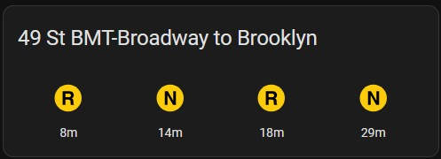

# Sample Card Configs for Arrival Boards

## Icon Arrival Card 

This card can be a good setup for NYC Subway arrivals as they have iconic "bullets" indicating the service a train provides. The example also includes a conditional that shows if an alert is available on the line. 

[View the example here](./icon_arrival_card.yml)

## Tile Arrival Card

This card setup is more typical of any train arrival board that might be common in a train station.  Depending on the system and the information it provides, either the `headsign` or `destination` attribute may be more informative to include in the card data. 

[View the example here](./tile_arrival_card.yml)

